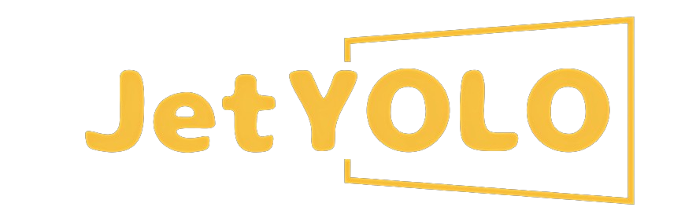
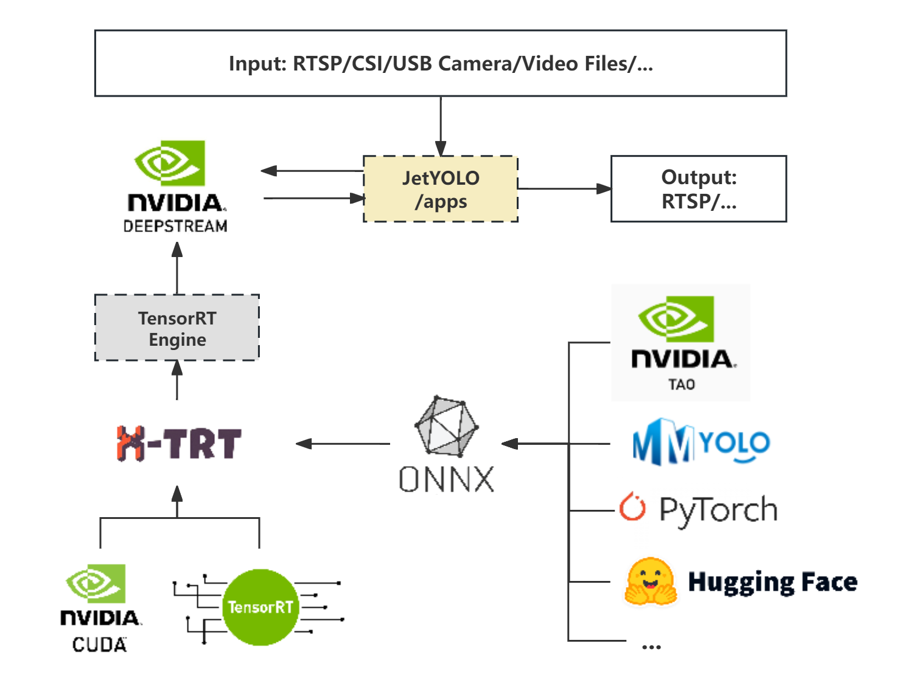
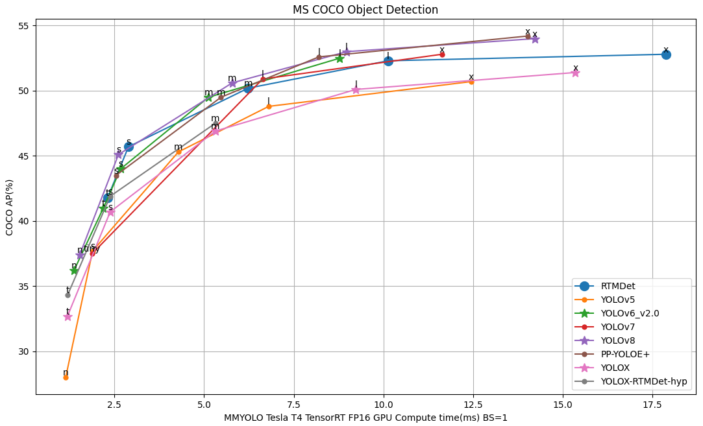

<div align="center">
  
  <div>&nbsp;</div>
  <div align="center">
    <b><font size="5">JetYOLO document</font></b>
    <sup>
      <a href="https://github.com/gitctrlx/JetYOLO/tree/main/doc">
        <i><font size="4">HOT</font></i>
      </a>
    </sup>
    &nbsp;&nbsp;&nbsp;&nbsp;
    <b><font size="5">JetYOLO installation</font></b>
    <sup>
      <a href="https://github.com/gitctrlx/JetYOLO?tab=readme-ov-file#Installation">
        <i><font size="4">TRY IT OUT</font></i>
      </a>
    </sup>
  </div>
  <div>&nbsp;</div>
</div>

## 📄 Table of Contents

- [🎉 What's New](#-whats-new)
- [📚 Introduction](#-introduction)
- [⚙️ Installation](#️-installation)
  - [🔖 Docker](#-docker)
  - [💡 Prerequisites](#-prerequisites)
  - [🛠️ Build](#️-build)
- [✏️ Tutorial](#️-tutorial)
  - [🧨 Quick Start](#-quick-start)
    - [1. Data Preparation](#1-data-preparation)
    - [2. Model Preparation](#2-model-preparation)
    - [3. Building the Engine](#3-building-the-engine)
    - [4. Executing Inference (demo)](#4-executing-inference-demo)
- [💻 Overview of Benchmark and Model Zoo](#-overview-of-benchmark-and-model-zoo)
- [📖 Document](#-document)
- [❓ FAQ](#-faq)
- [🧾 License](#-license)
- [🎯 Reference](#-reference)


## 🎉 What's New

✨**v0.1.0** First release on March 10, 2024:

- JetYOLO is born!

## 📚 Introduction

This project harnesses NVIDIA's CUDA and TensorRT through the DeepStream toolkit to enable the creation of real-world streaming analytics applications with ease. Aimed at lowering the entry barrier for developers, it provides a lightweight, intuitive platform that simplifies the entire development cycle of DeepStream applications, from model training to deployment and inference. Key features include:

- **Ease of Use**: Reduces complexity, enabling quick start and rapid development.
- **Comprehensive Toolkit**: Includes all necessary tools for the development process, from training to deployment, ensuring a smooth workflow.
- **Modular Design**: Tools can be used independently, catering to specific project needs.
- **High-Performance Inference**: Features a high-efficiency inference framework optimized with TensorRT, including model quantization and performance analysis tools.
- **Practical Case Studies**: Offers multiple real-world examples demonstrating the framework's applicability and effectiveness.

Our goal is to make the development of streaming analytics applications more accessible to developers of all skill levels, fostering the creation of innovative solutions across various domains.



**The JetYOLO project workflow is streamlined and consists of just three steps:**

1. **Start with a Pre-trained Model**: Obtain a pre-trained model from common training frameworks and export it as an ONNX file.
2. **Build the TensorRT Engine with X-TRT**: Import the ONNX model into our X-TRT, a lightweight inference tool, to construct a TensorRT engine. Within XTRT, you have the flexibility to customize and modify the ONNX model file, use tools for model quantization scripts to quantize the model, and employ performance analysis tools to test accuracy and optimize the model.
3. **Integrate with DeepStream for Application Development**: Configure the exported Engine file from X-TRT into the DeepStream configuration files for further application development, such as people flow detection, to create tailored applications.

## ⚙️ Installation

### 💡 Prerequisites

#### 🔖 Docker

We recommend deploying with Docker for the quickest project startup. Docker images for both X86 architecture and NVIDIA Jetson ARM architecture are provided (coming soon!). 

```bash
docker build -f docker/[dockerfile]
```

If you prefer to manually configure the environment, please continue reading the section below.

#### 🔖 NVIDIA Jetson Appliances

- [JetPack SDK](https://developer.nvidia.com/embedded/jetpack) >= v5.0.2
- [DeepStream](https://developer.nvidia.com/deepstream-sdk) >= v6.2

#### 🔖 Windows or Linux (x86)

To build the `JetYOLO` components, you will first need the following software packages.

**TensorRT**

- [TensorRT](https://developer.nvidia.com/nvidia-tensorrt-download) >= v8.5

**DeepStream**

- [DeepStream](https://developer.nvidia.com/deepstream-sdk) >= v6.2

**System Packages**

- [CUDA](https://developer.nvidia.com/cuda-toolkit)

  Recommended versions:

  - cuda-12.2.0 + cuDNN-8.8
  - cuda-11.8.0 + cuDNN-8.8

- [GNU make](https://ftp.gnu.org/gnu/make/) >= v4.1

- [cmake](https://github.com/Kitware/CMake/releases) >= v3.11

- [python](https://www.python.org/downloads/) >= v3.8, <= v3.10.x

- [pip](https://pypi.org/project/pip/#history) >= v19.0

- Essential utilities

  - [git](https://git-scm.com/downloads), [pkg-config](https://www.freedesktop.org/wiki/Software/pkg-config/), [wget](https://www.gnu.org/software/wget/faq.html#download)

**Pytorch（Optional）**

- You need the CUDA version of [PyTorch](https://pytorch.org/get-started/locally/). If your device is **Jetson**, please refer to the [Jetson Models Zoo](https://elinux.org/Jetson_Zoo) for installation.

### 🛠️ build

If you have completed the above environment setup, you can proceed with the following steps. Building the Basic Inference Framework：

```bash
git clone --recurse-submodules https://github.com/gitctrlx/JetYOLO.git

cmake -S . -B build \
    -DCMAKE_BUILD_TYPE=Release \
    -DCMAKE_CUDA_ARCHITECTURES=72 \
    -DBUILD_XRT=ON \
    -DBUILD_NVDSINFER_CUSTOM_IMPL=ON \
    -DBUILD_TOOLS_POLYGON_DRAW=ON \
    -DBUILD_APPS_DS_YOLO_DETECT=ON \
    -DBUILD_APPS_DS_YOLO_FACE=ON \
    -DBUILD_APPS_DS_YOLO_POSE=ON \
    -DBUILD_APPS_DS_YOLO_TRACKER=ON 

cmake --build build
```

Configure your build with the following options to tailor the setup to your needs:

- **`-DCMAKE_BUILD_TYPE=Release`**: Sets the build type to Release for optimized performance.
- **`-DCMAKE_CUDA_ARCHITECTURES=72`**: Specify the CUDA compute capability (sm) of your host (Jetson Xavier nx:72).
- **`-DBUILD_XRT=ON`**: Enables the build of xtrt, our lightweight, high-performance inference tool.
- **`-DBUILD_NVDSINFER_CUSTOM_IMPL=ON`**: Determines whether to compile the DeepStream plugin for app applications.
- **`-DBUILD_TOOLS_POLYGON_DRAW=ON`**: Controls the inclusion of the bounding box drawing tool in the `app/ds_yolo_tracker` application.
- **`-DBUILD_APPS_DS_YOLO_DETECT=ON`**: Determines whether to build the `app/ds_yolo_detect` application.
- **`-DBUILD_APPS_DS_YOLO_FACE=ON`**: Determines whether to build the `app/ds_yolo_face` application.
- **`-DBUILD_APPS_DS_YOLO_POSE=ON`**: Determines whether to build the `app/ds_yolo_pose` application.
- **`-DBUILD_APPS_DS_YOLO_TRACKER=ON`**: Determines whether to build the `app/ds_yolo_tracker` application.

> If you are unsure about your **CUDA SM** version, you can run `tools/cudasm.sh` to check. For more details, please see [FAQ](doc/faq.md).
>
> We recommend enabling all options for the build. If you encounter errors during compilation, you can selectively disable some options to troubleshoot, or feel free to submit an issue to us. We are more than happy to assist in resolving it.


(Optional) If you would like to use the complete set of tools developed in Python, please install the following: 

```python
python3 -m pip install xtrt/requirements.txt
```


## ✏️ Tutorial

### 🧨 Quick Start

#### 1. Data Preparation

Data is used for calibration during quantization. We plan to use the [COCO val dataset](http://images.cocodataset.org/zips/val2017.zip) for model quantization calibration work. Place the downloaded val2017 dataset in the `xtrt/data/coco` directory.

```bash
xtrt\
 └── data
    └── coco
        ├── annotations
        └── val2017
```

#### 2. Model Preparation

Place the prepared ONNX file into the weights folder. You can directly download the ONNX weights we have exported from HuggingFace, all weights originate from [mmyolo pre-trained weights](https://github.com/open-mmlab/mmyolo/tree/main). You also have the option to configure mmyolo to freely export weights, or use other object detection models to export ONNX. The related code can be found in `xtrt/tools/modify_onnx`.

> There are two formats of ONNX exported by mmyolo. One is an end-to-end ONNX that has added the `EfficientNMS` node from `TensorRT8`, and the other is a pure model part that has removed the decode part (including three output results). For detailed content, please see the [detailed tutorial](doc/tutorial.md) document. You can use the ONNX model that has added `EfficientNMS`, or use the model that has removed the decode part and manually add plugins for acceleration. The related code can be found in `xtrt/tools/modify_onnx`.

#### 3. Building the Engine

Once the dataset is ready, the next step is to construct the engine. Below is an example for building a YOLOv5s TensorRT engine, with the corresponding code located in `scripts/build.sh`:

```sh
./build/build \
    "./weights/yolov5s_trt8.onnx" \    # ONNX Model File Path
    "./engine/yolo.plan" \             # TensorRT Engine Save Path
    "int8" \                           # Quantization Precision
    3 \                                # TRT Optimization Level
    1 1 1 \                            # Dynamic Shape Parameters
    3 3 3 \							 
    640 640 640 \					   
    640 640 640 \					   
    550 \                              # Calibration Iterations
    "./data/coco/val2017" \	           # Calibration Dataset Path
    "./data/coco/filelist.txt" \       # Calibration Image List
    "./engine/int8Cache/int8.cache" \  # Calibration File Save Path
    true \                             # Timing Cache Usage
    false \                            # Ignore Timing Cache Mismatch
    "./engine/timingCache/timing.cache"# Timing Cache Save Path
```

For a detailed analysis of the code's parameters, please see the [detailed documentation](doc).

**Verify the engine: Executing Inference（demo）**

**Note**: Run the demo to test if the engine was built successfully.

- demo-1: Inferencing a single image using the built YOLO TensorRT engine.


```sh
./build/yolo_det_img \
    "engine/yolo_m.plan" \   # TensorRT Engine Save Path
    "media/demo.jpg" \       # Input Image Path
    "output/output.jpg"\     # Output Image Path
    2 \                      # Pre-processing Pipeline
    1 3 640 640              # Input Model Tensor Values
```

- demo-2: Inferencing a video using the built YOLO TensorRT engine.


```sh
./build/yolo_det \
    "engine/yolo_trt8.plan" \ # TensorRT Engine Save Path
    "media/c3.mp4" \          # Input Image Path 
    "output/output.mp4"\      # Output Image Path
    2 \	                      # Pre-processing Pipeline
    1 3 640 640	              # Input Model Tensor Values
```

Then you can find the output results in the `xtrt/output` folder.

> For a detailed analysis of the code's parameters, please see the [detailed documentation](doc).

#### 4. DeepStream

Next, you can use DeepStream to build end-to-end, AI-driven applications for analyzing video and sensor data. Popular use cases include retail analytics, parking management, logistics management, optical inspection, robotics, and sports analytics. DeepStream SDK 6.1.1 now supports audio. Please download the software and refer to the audio and Automatic Speech Recognition (ASR) applications. Learn more by reading about the [ASR DeepStream Plugin](https://docs.nvidia.com/metropolis/deepstream/dev-guide/text/DS_plugin_gst-nvdsasr.html).

**Quick Start**

You can quickly launch a DeepStream application using DeepStream:
First, you need to modify the `deepstream_app_config.txt` configuration file, changing the engine file path to your actual engine file path. Since the engine is built in xtrt, you can find the engine file in the `xtrt/engine` folder. Additionally, you need to ensure that your plugin's path has been compiled. The plugin code is by default located in the `nvdsinfer_custom_impl` folder, and the compiled plugin `.so` files are located in the `build` directory.

```sh
deepstream-app -c deepstream_app_config.txt
```

**Applications**

We also provide some example applications created with `deepstream`, located in the `app` folder.

```
./build 
```


## 💻 Overview of Benchmark and Model Zoo

### 🔖 Benchmark

Leveraging MMYOLO's comprehensive suite of pre-trained models, we have utilized its provided pre-trained models to convert into TensorRT engines at `fp16 precision`, incorporating the `TensorRT8-EfficientNMS` plugin. This process was aimed at evaluating the accuracy and speed of inference on the `COCO val2017 dataset` under these conditions. 

The following graph displays the benchmarks achieved using [MMYOLO](https://mmyolo.readthedocs.io/zh-cn/latest/model_zoo.html) on an NVIDIA Tesla T4 platform:



> The evaluation results above are from the [MMYOLO](https://mmyolo.readthedocs.io/zh-cn/latest/model_zoo.html) model under FP16 precision. The "TRT-FP16-GPU-Latency(ms)" refers to the GPU compute time for model forwarding only on the NVIDIA Tesla T4 device using TensorRT 8.4, with a batch size of 1, testing shape of 640x640 (for YOLOX-tiny, the testing shape is 416x416).
>
> **Note：**In practical tests, we found that on the Jetson platform, due to differences in memory size, there might be some impact on the model's accuracy. This is because TensorRT requires sufficient memory during the engine construction phase to test certain strategies. Across different platforms, there could be an accuracy loss of about `0.2%-0.4%`.

### 🔖 Model Zoo

For convenience, you can use the YOLO series ONNX models we have uploaded to HuggingFace. However, if you prefer to export your own ONNX models, you have the option to use your models or download the original [pre-trained PyTorch model weights](https://github.com/open-mmlab/mmyolo/tree/main) from MMYOLO. Follow the steps outlined in the [MMYOLO documentation](https://github.com/open-mmlab/mmyolo/blob/main/projects/easydeploy/docs/model_convert.md) and use the [`export_onnx.py`](https://github.com/open-mmlab/mmyolo/blob/main/projects/easydeploy/tools/export_onnx.py) script to convert your model into the ONNX format.

> **Note：**The models we have uploaded to HuggingFace are exported to ONNX from MMYOLO's pre-trained models and are available in two formats: one is an end-to-end model that includes the EfficientNMS plugin, and the other has the decode step removed. Please choose the version that best fits your needs. For more information, refer to the [detailed documentation](doc).

## 📖 Document

For more detailed tutorials about the project, please refer to the [detailed documentation](doc).

## ❓ FAQ

Please refer to the [FAQ](doc/faq.md) for frequently asked questions.

## 🧾 License

This project is released under the [GPL 3.0 license](LICENSE.txt).

## 🎯 Reference

This project references many excellent works from predecessors, and some useful repository links are provided at the end.

1. [TensorRT](https://github.com/NVIDIA/TensorRT)
2. [mmyolo](https://github.com/open-mmlab/mmyolo)
3. [Lidar_AI_Solution](https://github.com/NVIDIA-AI-IOT/Lidar_AI_Solution)
4. [DeepStream-Yolo](https://github.com/marcoslucianops/DeepStream-Yolo)
5. [DeepStream-Yolo-Face](https://github.com/marcoslucianops/DeepStream-Yolo-Face)
6. [DeepStream-Yolo-Pose](https://github.com/marcoslucianops/DeepStream-Yolo-Pose)
7. [deepstream_lpr_app](https://github.com/NVIDIA-AI-IOT/deepstream_lpr_app)
8. [CVprojects](https://github.com/enpeizhao/CVprojects)

