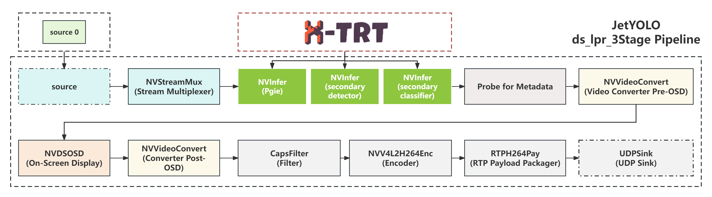

<div align="center">
  
  <div>&nbsp;</div>
  <div align="center">
    <b><font size="5">JetYOLO document</font></b>
    <sup>
      <a href="https://github.com/gitctrlx/JetYOLO/tree/main/doc">
        <i><font size="4">HOT</font></i>
      </a>
    </sup>
    &nbsp;&nbsp;&nbsp;&nbsp;
    <b><font size="5">JetYOLO installation</font></b>
    <sup>
      <a href="https://github.com/gitctrlx/JetYOLO?tab=readme-ov-file#%EF%B8%8F-installation">
        <i><font size="4">TRY IT OUT</font></i>
      </a>
    </sup>
  </div>
  <div>&nbsp;</div>
</div>


## 📄 Table of Contents

- [🎉 What's New](#-whats-new)
- [📚 Introduction](#-introduction)
- [⚙️ Installation](#️-installation)
  - [🔖 Docker](#-docker (coming soon!) )
  - [💡 Prerequisites](#-prerequisites)
  - [🛠️ Build](#️-build)
- [✏️ Tutorial](#️-tutorial)
  - [🧨 Quick Start](#-quick-start)
    - [1. Data Preparation](#1-data-preparation)
    - [2. Model Preparation](#2-model-preparation)
    - [3. Building the Engine](#3-building-the-engine)
    - [4. DeepStream](#4-deepStream)
- [🪄 Applications](#-applications)
- [💻 Overview of Benchmark and Model Zoo](#-overview-of-benchmark-and-model-zoo)
- [📖 Document](#-document)
- [❓ FAQ](#-faq)
- [🧾 License](#-license)
- [🎯 Reference](#-reference)


## 🎉 What's New

✨**v0.1.0** First release on March 10, 2024: 

- JetYOLO is born!

## 📚 Introduction

This project leverages the DeepStream toolkit along with NVIDIA's CUDA and TensorRT to effortlessly create real-time streaming analytics applications for a broad range of scenarios. Aimed at lowering the barrier to entry for developers, it offers a lightweight, intuitive platform that simplifies the entire development cycle of DeepStream applications, encompassing model deployment, inference, and TensorRT optimization. Key features include:

- **Ease of Use**: Reduces project complexity, enabling quick startup and rapid development. Each component follows a modular design for further decoupling, allowing every tool and application to be independently utilized, meeting specific project requirements.
- **Comprehensive Toolkit**: Includes all necessary tools for developing high-performance inference applications in edge computing, offering a suite from model export to modification, quantization, deployment, and optimization, ensuring a smooth development process and efficient model operation.
- **High-Performance Inference**: We've also developed a high-efficiency inference framework, xtrt, based on [NVIDIA TensorRT](https://github.com/NVIDIA/TensorRT) and [CUDA](https://developer.nvidia.com/cuda-toolkit), integrated with [NVIDIA Polygraph](https://github.com/NVIDIA/TensorRT/tree/release/8.6/tools/Polygraphy), [ONNX GraphSurgeon](https://github.com/NVIDIA/TensorRT/tree/release/8.6/tools/onnx-graphsurgeon), and the [PPQ](https://github.com/openppl-public/ppq) quantization tool, among others. This framework features comprehensive model modification, quantization, and performance analysis tools for easy and quick debugging and optimization.
- **Practical Case Studies**: Provides multiple real-world examples demonstrating the framework's applicability and effectiveness, with minor adjustments needed to fit a wide range of application scenarios.

Our goal is to make the development of streaming analytics applications more accessible to developers of all skill levels, fostering the creation of innovative solutions across various domains.


**The JetYOLO project workflow is streamlined and consists of just three steps:**

1. **Start with a Pre-trained Model**: Obtain a pre-trained model from common training frameworks and export it as an ONNX file.
2. **Build the TensorRT Engine with X-TRT**: Import the ONNX model into our X-TRT, a lightweight inference tool, to construct a TensorRT engine. Within XTRT, you have the flexibility to customize and modify the ONNX model file, use tools for model quantization scripts to quantize the model, and employ performance analysis tools to test accuracy and optimize the model.
3. **Integrate with DeepStream for Application Development**: Configure the exported Engine file from X-TRT into the DeepStream configuration files for further application development, such as people flow detection, to create tailored applications.

## ⚙️ Installation

### 💡 Prerequisites

#### 🔖 Docker (coming soon!) 

We recommend deploying with Docker for the quickest project startup. Docker images for both X86 architecture and NVIDIA Jetson ARM architecture are provided. 

```bash
docker build -f docker/[dockerfile]
```

If you prefer to manually configure the environment, please continue reading the section below.

#### 🔖 NVIDIA Jetson Appliances

- [JetPack SDK](https://developer.nvidia.com/embedded/jetpack) >= v5.0.2
- [DeepStream](https://developer.nvidia.com/deepstream-sdk) >= v6.2

#### 🔖 Windows or Linux (x86)

<details>
<summary><strong>Click to expand to read the detailed environment configuration.</strong></summary>
<div>

To build the `JetYOLO` components, you will first need the following software packages.

**TensorRT**

- [TensorRT](https://developer.nvidia.com/nvidia-tensorrt-download) >= v8.5

**DeepStream**

- [DeepStream](https://developer.nvidia.com/deepstream-sdk) >= v6.2

**System Packages**

- [CUDA](https://developer.nvidia.com/cuda-toolkit)

  Recommended versions:

  - cuda-12.2.0 + cuDNN-8.8
  - cuda-11.8.0 + cuDNN-8.8

- [GNU make](https://ftp.gnu.org/gnu/make/) >= v4.1

- [cmake](https://github.com/Kitware/CMake/releases) >= v3.11

- [python](https://www.python.org/downloads/) >= v3.8, <= v3.10.x

- [pip](https://pypi.org/project/pip/#history) >= v19.0

- Essential utilities

  - [git](https://git-scm.com/downloads), [pkg-config](https://www.freedesktop.org/wiki/Software/pkg-config/), [wget](https://www.gnu.org/software/wget/faq.html#download)

**Pytorch（Optional）**

- You need the CUDA version of [PyTorch](https://pytorch.org/get-started/locally/). If your device is **Jetson**, please refer to the [Jetson Models Zoo](https://elinux.org/Jetson_Zoo) for installation.

- You need the CUDA version of [PyTorch](https://pytorch.org/get-started/locally/). If your device is **Jetson**, please refer to the [Jetson Models Zoo](https://elinux.org/Jetson_Zoo) for installation.

</div>
</details>

### 🛠️ build

If you have completed the above environment setup, you can proceed with the following steps. Building the Basic Inference Framework：

```bash
git clone --recurse-submodules https://github.com/gitctrlx/JetYOLO.git

cmake -S . -B build \
    -DCMAKE_BUILD_TYPE=Release \
    -DCMAKE_CUDA_ARCHITECTURES=72 \
    -DBUILD_XRT=ON \
    -DBUILD_NVDSINFER_CUSTOM_IMPL=ON \
    -DBUILD_TOOLS_POLYGON_DRAW=ON \
    -DBUILD_APPS_DS_YOLO_DETECT=ON \
    -DBUILD_APPS_DS_YOLO_LPR=ON \
    -DBUILD_APPS_DS_YOLO_TRACKER=ON 

cmake --build build
```

Configure your build with the following options to tailor the setup to your needs:

- **`-DCMAKE_BUILD_TYPE=Release`**: Sets the build type to Release for optimized performance.
- **`-DCMAKE_CUDA_ARCHITECTURES=72`**: Specify the CUDA compute capability (sm) of your host (`Jetson Xavier NX: 72`).
- **`-DBUILD_XRT=ON`**: Enables the build of xtrt, our lightweight, high-performance inference tool.
- **`-DBUILD_NVDSINFER_CUSTOM_IMPL=ON`**: Determines whether to compile the DeepStream plugin for app applications.
- **`-DBUILD_TOOLS_POLYGON_DRAW=ON`**: Controls the inclusion of the bounding box drawing tool in the `app/ds_yolo_tracker` application.
- **`-DBUILD_APPS_DS_YOLO_DETECT=ON`**: Determines whether to build the `app/ds_yolo_detect` application.
- **`-DBUILD_APPS_DS_YOLO_LPR=ON`**: Determines whether to build the `app/ds_yolo_lpr` application.
- **`-DBUILD_APPS_DS_YOLO_TRACKER=ON`**: Determines whether to build the `app/ds_yolo_tracker` application.

> If you are unsure about your **CUDA SM** version, you can run `tools/cudasm.sh` to check. For more details, please see [FAQ](doc/faq.md).
>
> We recommend enabling all options for the build. If you encounter errors during compilation, you can selectively disable some options to troubleshoot, or feel free to submit an issue to us. We are more than happy to assist in resolving it.

(Optional) If you would like to use the complete set of tools developed in Python, please install the following: 

```python
python3 -m pip install xtrt/requirements.txt
```


## ✏️ Tutorial

### 🧨 Quick Start

#### 1. (Optional) Data Preparation

Data is used for calibration during quantization. We plan to use the [COCO val dataset](http://images.cocodataset.org/zips/val2017.zip) for model quantization calibration work. Place the downloaded val2017 dataset in the `xtrt/data/coco` directory.

```bash
xtrt\
 └── data
    └── coco
        ├── annotations
        └── val2017
```

#### 2. Model Preparation

Place the prepared ONNX file into the weights folder. You can directly download the ONNX weights we have exported from HuggingFace, all weights originate from [mmyolo pre-trained weights](https://github.com/open-mmlab/mmyolo/tree/main). You also have the option to configure mmyolo to freely export weights, or use other object detection models to export ONNX. The related code can be found in `xtrt/tools/modify_onnx`.

> There are two formats of ONNX exported by mmyolo. One is an end-to-end ONNX that has added the `EfficientNMS` node from `TensorRT8`, and the other is a pure model part that has removed the decode part (including three output results). For detailed content, please see the [detailed tutorial](doc/tutorial.md) document. You can use the ONNX model that has added `EfficientNMS`, or use the model that has removed the decode part and manually add plugins for acceleration. The related code can be found in `xtrt/tools/modify_onnx`.

#### 3. Building the Engine

Once the dataset is ready, the next step is to construct the engine. Below is an example for building a YOLOv5s TensorRT engine, with the corresponding code located in `scripts/build.sh`:

```sh
./build/build \
    "./weights/yolov5s_trt8.onnx" \    # ONNX Model File Path
    "./engine/yolo.plan" \             # TensorRT Engine Save Path
    "int8" \                           # Quantization Precision
    3 \                                # TRT Optimization Level
    1 1 1 \                            # Dynamic Shape Parameters
    3 3 3 \							 
    640 640 640 \					   
    640 640 640 \					   
    550 \                              # Calibration Iterations
    "./data/coco/val2017" \	           # Calibration Dataset Path
    "./data/coco/filelist.txt" \       # Calibration Image List
    "./engine/int8Cache/int8.cache" \  # Calibration File Save Path
    true \                             # Timing Cache Usage
    false \                            # Ignore Timing Cache Mismatch
    "./engine/timingCache/timing.cache"# Timing Cache Save Path
```

For a detailed analysis of the code's parameters, please see the [detailed documentation](doc).

**Verify the engine: Executing Inference（xtrt's inference demo）**

**Note**: Run the demo to test if the engine was built successfully.

- demo-1: Inferencing a single image using the built YOLO TensorRT engine.


```sh
./build/yolo_det_img \
    "engine/yolo_m.plan" \   # TensorRT Engine Save Path
    "media/demo.jpg" \       # Input Image Path
    "output/output.jpg"\     # Output Image Path
    2 \                      # Pre-processing Pipeline
    1 3 640 640              # Input Model Tensor Values
```

- demo-2: Inferencing a video using the built YOLO TensorRT engine.


```sh
./build/yolo_det \
    "engine/yolo_trt8.plan" \ # TensorRT Engine Save Path
    "media/c3.mp4" \          # Input Image Path 
    "output/output.mp4"\      # Output Image Path
    2 \	                      # Pre-processing Pipeline
    1 3 640 640	              # Input Model Tensor Values
```

Then you can find the output results in the `xtrt/output` folder.

> For a detailed analysis of the code's parameters, please see the [detailed documentation](doc).

#### 4. DeepStream

Next, you can use DeepStream to build end-to-end, AI-driven applications for analyzing video and sensor data.

**Quick Start**

- You can quickly launch a DeepStream application using deepStream-app:

Before running the code below, please make sure that you have built the engine file using `xtrt`, meaning you have completed the section `3. Building the Engine.`

```sh
deepstream-app -c deepstream_app_config.txt
```

> **Note:**  If you wish to start directly from this step, please ensure that you have completed the following preparations:
>
> First, you need to modify the `deepstream_app_config.txt` configuration file by updating the engine file path to reflect your actual engine file path. Given that the engine is built within xtrt, you will find the engine file within the `xtrt/engine` directory. In addition to this, it is crucial to verify that the path to your plugin has been properly compiled. By default, the plugin code resides in the `nvdsinfer_custom_impl` folder, while the compiled plugin `.so` files can be found in the `build/nvdsinfer_custom_impl` directory.

- Alternatively, you can run the following code to view an example of the detection inference:


```bash
./build/apps/ds_yolo_detect/ds_detect file:///opt/nvidia/deepstream/deepstream/samples/streams/sample_1080p_h264.mp4
```


> **Note:**
>
> The command to run is: `./build/apps/ds_yolo_tracker/ds_tracker_app [Your video file path or RTSP stream URL]`
>
> Display Contents:
>
> - The top left corner shows the current frame's pedestrian and vehicle count.
> - Detected individuals and vehicles within the frame will be marked with bounding boxes.

This example is based on the `app/ds_yolo_detect` directory, showcasing its processing pipeline as illustrated below:


Upon running the application, you can view the output stream on players like [VLC](https://www.videolan.org/vlc/) by entering: `rtsp://[IP address of the device running the application]:8554/ds-test`. This allows you to see:

> **Note：**The streamed video output can be viewed on any device within the same local network.


## 🪄 **Applications**

We also provide some example applications created with `deepstream`, located in the `app` folder.

### Personnel/Vehicle Boundary Detection

#### Single-Stream Inference Application:

This feature enables real-time tracking and boundary detection for individuals and vehicles using a single video stream. The application utilizes DeepStream for efficient processing.

This example is based on the `app/ds_yolo_tracker` directory, showcasing its processing pipeline as illustrated below:


To view an inference example, execute the following command:

```sh
./build/apps/ds_yolo_tracker/ds_tracker_app file:///opt/nvidia/deepstream/deepstream/samples/streams/sample_1080p_h264.mp4
```

> **Usage:** 
>
> - `./build/apps/ds_yolo_tracker/ds_tracker_app [Your video file path or RTSP stream URL]`
>
> **Display Features:**
>
> - The top-left corner shows the total count of pedestrians and vehicles that have passed.
> - At the center is a boundary detection box; vehicles crossing this area are highlighted with a red bounding box.

Upon running the application, you can view the output stream on players like [VLC](https://www.videolan.org/vlc/) by entering: `rtsp://[IP address of the device running the application]:8554/ds-test`. This allows you to see:

> **Note：**The streamed video output can be viewed on any device within the same local network.


#### Multi-Stream Application:

This application extends the capabilities of the single-stream inference application to support simultaneous processing and analysis of multiple video streams. It enables efficient monitoring and boundary detection for individuals and vehicles across several feeds, leveraging NVIDIA DeepStream for optimized performance.

This example is based on the `app/ds_yolo_tracker` directory, showcasing its processing pipeline as illustrated below:


To run the application with multiple video feeds, use the following command syntax:

```sh
./build/apps/ds_yolo_tracker/ds_tracker_app_multi file:///opt/nvidia/deepstream/deepstream/samples/streams/sample_1080p_h264.mp4  file:///opt/nvidia/deepstream/deepstream/samples/streams/sample_1080p_h264.mp4
```

> **Usage:** 
>
> - `./build/apps/ds_yolo_tracker/ds_tracker_app_multi [Video file path or RTSP stream URL 1] [Video file path or RTSP stream URL 2] [...]`
> - **note:** After compilation, the current program only supports input from two stream addresses. If you wish to facilitate input from more streams, you will need to modify the corresponding code. For details, please refer to the [detailed documentation](doc).
>
> **Display Features:** The application provides a unified display that incorporates elements from all the processed streams.
>
> - **Overall Counts:** The top-left corner of each video feed display shows the total count of pedestrians and vehicles that have passed within that specific stream.
> - **Boundary Detection Box:** A boundary detection box is presented at the center of each video feed. Vehicles crossing this predefined area in any of the streams are immediately highlighted with a red bounding box to signify a boundary violation.

Upon running the application, you can view the output stream on players like [VLC](https://www.videolan.org/vlc/) by entering: `rtsp://[IP address of the device running the application]:8554/ds-test`. This allows you to see:

> **Note：**The streamed video output can be viewed on any device within the same local network.


### License Plate Detection/Recognition

The DeepStream application offers a comprehensive solution for detecting and recognizing license plates in real-time.

This example is based on the `app/ds_yolo_lpr` directory, showcasing its processing pipeline as illustrated below:


To launch the license plate detection and recognition feature, use the following command:

```
./build/apps/ds_yolo_lpr/ds_lpr [file or rtsp]
```

> **Usage:** 
>
> - `./build/apps/ds_yolo_lpr/ds_lpr [Your video file path or RTSP stream URL]`
>
> **Display Features:**
>
> - The number displayed in the top-left corner of the screen indicates the total count of license plates detected in the current frame.
> - License plates within the frame are enclosed by detection boxes, and when the plate content is fully recognized, the plate number will be displayed above the detection box. The confidence level of the recognition result is shown on the right side of the detection box.

Upon running the application, you can view the output stream on players like [VLC](https://www.videolan.org/vlc/) by entering: `rtsp://[IP address of the device running the application]:8554/ds-test`.  The application displays the detected license plates and their recognized characters.

> **Note：**The streamed video output can be viewed on any device within the same local network.


> PS: The video is sourced from the [internet](https://www.bilibili.com/video/BV1pb41137Sr). Should there be any copyright infringement, please notify for removal.

This functionality is based on the NVIDIA-AI-IOT lab's three-stage license plate detection project at [deepstream_lpr_app](https://github.com/NVIDIA-AI-IOT/deepstream_lpr_app), with modifications for enhanced performance.

We have also provided a flowchart for the three-stage license plate detection and recognition process as follows. For a detailed analysis, please refer to the [detailed documentation](doc).



### TODO

+ [ ] Face Detection and Pose Recognition Project Initiatives

> **Note：**
>
> We are setting out to develop practical applications for face detection and pose recognition by building upon the foundation laid by exemplary works, namely [DeepStream-Yolo-Face](https://github.com/marcoslucianops/DeepStream-Yolo-Face) and [DeepStream-Yolo-Pose](https://github.com/marcoslucianops/DeepStream-Yolo-Pose). Our objective includes devising compelling applications such as detecting human falls. 
>
> Additionally, we plan to integrate these solutions with our [XTRT](https://github.com/gitctrlx/xtrt) inference engine. The integration aims at enhancing the performance of the Yolo-Face and Yolo-Pose TensorRT engines through plugin-based optimizations for smoother and more efficient inference. We are open to new ideas and invite contributions and suggestions to further enrich our project.


## 💻 Overview of Benchmark and Model Zoo

### 🔖 Benchmark

Leveraging MMYOLO's comprehensive suite of pre-trained models, we have utilized its provided pre-trained models to convert into TensorRT engines at `fp16 precision`, incorporating the `TensorRT8-EfficientNMS` plugin. This process was aimed at evaluating the accuracy and speed of inference on the `COCO val2017 dataset` under these conditions. 

The following graph displays the benchmarks achieved using [MMYOLO](https://mmyolo.readthedocs.io/zh-cn/latest/model_zoo.html) on an NVIDIA Tesla T4 platform:


> The evaluation results above are from the [MMYOLO](https://mmyolo.readthedocs.io/zh-cn/latest/model_zoo.html) model under FP16 precision. The "TRT-FP16-GPU-Latency(ms)" refers to the GPU compute time for model forwarding only on the NVIDIA Tesla T4 device using TensorRT 8.4, with a batch size of 1, testing shape of 640x640 (for YOLOX-tiny, the testing shape is 416x416).
>
> **Note：**In practical tests, we found that on the Jetson platform, due to differences in memory size, there might be some impact on the model's accuracy. This is because TensorRT requires sufficient memory during the engine construction phase to test certain strategies. Across different platforms, there could be an accuracy loss of about `0.2%-0.4%`.

### 🔖 Model Zoo

For convenience, you can use the YOLO series ONNX models we have uploaded to HuggingFace. However, if you prefer to export your own ONNX models, you have the option to use your models or download the original [pre-trained PyTorch model weights](https://github.com/open-mmlab/mmyolo/tree/main) from MMYOLO. Follow the steps outlined in the [MMYOLO documentation](https://github.com/open-mmlab/mmyolo/blob/main/projects/easydeploy/docs/model_convert.md) and use the [`export_onnx.py`](https://github.com/open-mmlab/mmyolo/blob/main/projects/easydeploy/tools/export_onnx.py) script to convert your model into the ONNX format.

> **Note：**The models we have uploaded to HuggingFace are exported to ONNX from MMYOLO's pre-trained models and are available in two formats: one is an end-to-end model that includes the EfficientNMS plugin, and the other has the decode step removed. Please choose the version that best fits your needs. For more information, refer to the [detailed documentation](doc).

## 📖 Document

For more detailed tutorials about the project, please refer to the [detailed documentation](doc).

## ❓ FAQ

Please refer to the [FAQ](doc/faq.md) for frequently asked questions.

## 🧾 License

This project is released under the [GPL 3.0 license](LICENSE.txt).

## 🎯 Reference

This project references many excellent works from predecessors, and some useful repository links are provided at the end.

1. [TensorRT](https://github.com/NVIDIA/TensorRT)
2. [CVprojects](https://github.com/enpeizhao/CVprojects)
3. [mmyolo](https://github.com/open-mmlab/mmyolo)
4. [Lidar_AI_Solution](https://github.com/NVIDIA-AI-IOT/Lidar_AI_Solution)
5. [DeepStream-Yolo](https://github.com/marcoslucianops/DeepStream-Yolo)
6. [DeepStream-Yolo-Face](https://github.com/marcoslucianops/DeepStream-Yolo-Face)
7. [DeepStream-Yolo-Pose](https://github.com/marcoslucianops/DeepStream-Yolo-Pose)
8. [deepstream_lpr_app](https://github.com/NVIDIA-AI-IOT/deepstream_lpr_app)

