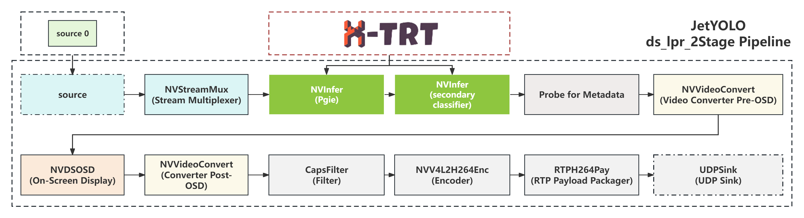
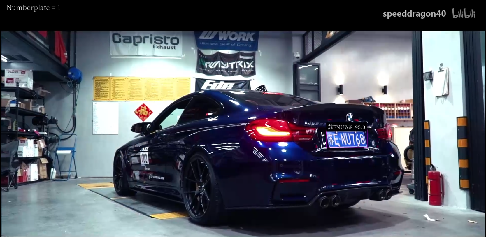

# DeepStream YOLO APP: License Plate Detection/Recognition

The DeepStream application offers a comprehensive solution for detecting and recognizing license plates in real-time.

This example is based on the `app/ds_yolo_lpr` directory, showcasing its processing pipeline as illustrated below:



**Note:** Before you run the command below, you need to prepare two stages of TensorRT engine files for the first stage of detection and the second stage of detection, with the corresponding code located in [`scripts/build_lpr_engine.sh`](https://github.com/gitctrlx/JetYOLO/blob/main/scripts/build_lpr_engine.sh):

```sh
./scripts/build_lpr_engine.sh
```

To launch the license plate detection and recognition feature, use the following command:

```
./build/apps/ds_yolo_lpr/ds_lpr [file or rtsp]
```

> **Usage:** 
>
> - `./build/apps/ds_yolo_lpr/ds_lpr [Your video file path or RTSP stream URL]`
>
> **Display Features:**
>
> - The number displayed in the top-left corner of the screen indicates the total count of license plates detected in the current frame.
> - License plates within the frame are enclosed by detection boxes, and when the plate content is fully recognized, the plate number will be displayed above the detection box. The confidence level of the recognition result is shown on the right side of the detection box.

Upon running the application, you can view the output stream on players like [VLC](https://www.videolan.org/vlc/) by entering: `rtsp://[IP address of the device running the application]:8554/ds-test`.  The application displays the detected license plates and their recognized characters.

> **Note：**The streamed video output can be viewed on any device within the same local network.



> PS: The video is sourced from the [internet](https://www.bilibili.com/video/BV1pb41137Sr). Should there be any copyright infringement, please notify for removal.

This functionality is based on the NVIDIA-AI-IOT lab's three-stage license plate detection project at [deepstream_lpr_app](https://github.com/NVIDIA-AI-IOT/deepstream_lpr_app), with modifications for enhanced performance.

We have also provided a flowchart for the three-stage license plate detection and recognition process as follows. For a detailed analysis, please refer to the [detailed documentation](doc).


### 