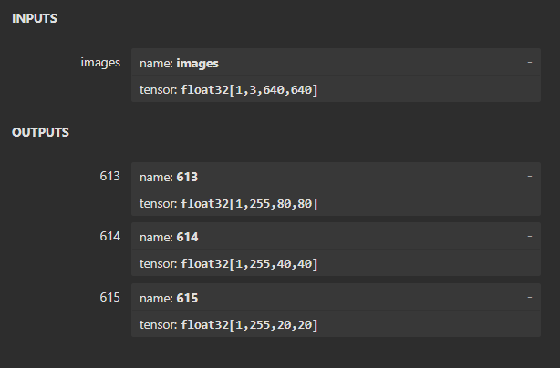

# MMYOLO Model ONNX Conversion

> This conversion document is adapted from the [`model_convert.md`](https://github.com/open-mmlab/mmyolo/blob/main/projects/easydeploy/docs/model_convert.md) document of [mmyolo](https://github.com/open-mmlab/mmyolo). If you want to use the following code or script to perform the export, you first need to install mmyolo and be in the mmyolo project directory.
>

## 1. Exporting ONNX Supported by Backend

### Environment Dependencies

- [onnx](https://github.com/onnx/onnx)

  ```shell
  pip install onnx
  ```

  [onnx-simplifier](https://github.com/daquexian/onnx-simplifier) (Optional, for simplifying the model)

  ```shell
  pip install onnx-simplifier
  ```

> Please ensure you run the relevant scripts from the `MMYOLO` root directory to avoid dependency package not found issues.

### Usage

The [model export script](./projects/easydeploy/tools/export_onnx.py) is used to convert the `MMYOLO` model into `onnx`.

### Parameter Introduction

- `config`: The configuration file used to build the model, such as [`yolov5_s-v61_syncbn_fast_8xb16-300e_coco.py`](./configs/yolov5/yolov5_s-v61_syncbn_fast_8xb16-300e_coco.py).
- `checkpoint`: The weight file obtained from training, such as `yolov5s.pth`.
- `--work-dir`: The path where the converted model is saved.
- `--img-size`: The input size during model conversion, such as `640 640`.
- `--batch-size`: The input `batch size` of the converted model.
- `--device`: The device used for model conversion, default is `cuda:0`.
- `--simplify`: Whether to simplify the exported `onnx` model, requiring the installation of [onnx-simplifier](https://github.com/daquexian/onnx-simplifier), default is off.
- `--opset`: Specifies the `opset` for exporting `onnx`, default is `11`.
- `--backend`: Specifies the backend name for which the `onnx` is exported, `ONNXRuntime`: `onnxruntime`, `TensorRT8`: `tensorrt8`, `TensorRT7`: `tensorrt7`, default is `onnxruntime` or `ONNXRuntime`.
- `--pre-topk`: Specifies the threshold number of candidate boxes selected during post-processing for exported `onnx`, default is `1000`.
- `--keep-topk`: Specifies the threshold number of candidate boxes for Non-Maximum Suppression (NMS) output for exported `onnx`, default is `100`.
- `--iou-threshold`: The `iou` threshold for filtering duplicate candidate boxes in Non-Maximum Suppression, default is `0.65`.
- `--score-threshold`: The threshold for filtering candidate box scores in Non-Maximum Suppression, default is `0.25`.
- `--model-only`: Specifies to only export the model backbone + neck, excluding post-processing, default is off.

Translation:

Example: Exporting the yolov5s onnx model using `Efficient_NMS`:

```shell
python ./projects/easydeploy/tools/export_onnx.py \
	configs/yolov5/yolov5_s-v61_syncbn_8xb16-300e_coco.py \
	yolov5s.pth \
	--work-dir work_dir \
    --img-size 640 640 \
    --batch 1 \
    --device cpu \
    --simplify \
	--opset 11 \
	--backend tensorrt8 \
	--pre-topk 1000 \
	--keep-topk 100 \
	--iou-threshold 0.65 \
	--score-threshold 0.25
```

Then, using backend-supported tools like `TensorRT`, read the `onnx` and convert it again into the backend-supported model formats such as `.engine/.plan`, etc.

> `MMYOLO` currently supports end-to-end model conversion for the `TensorRT8`, `TensorRT7`, `ONNXRuntime` backends, **currently only supporting the export and conversion of static shape models. The end-to-end conversion of models with dynamic batches or dynamic dimensions will continue to be supported in the future.**

The input and output of the onnx model obtained from the end-to-end conversion are as follows:


Input name: `images`, size 640x640

Output name: `num_dets`, size 1x1, indicating the number of detected objects.

Output name: `boxes`, size 1x100x4, indicating the coordinates of the detection boxes, formatted as `x1y1x2y2`.

Output name: `scores`, size 1x100, indicating the scores of the detection boxes.

Output name: `labels`, size 1x100, indicating the class id of the detection boxes.

The number in `num_dets` can be used to truncate `boxes`, `scores`, `labels`, extracting the top `num_dets` targets from the 100 detection results as the final detection output.


## 2. Exporting Only the Model Backbone + Neck

When you need to deploy on platforms that do not support end-to-end deployment, such as non-`TensorRT`, `ONNXRuntime`, etc., you can consider using the `--model-only` parameter without passing the `--backend` parameter. You will export a model that contains only the `Backbone` + `Neck`.

The input and output of the converted `onnx` model are as follows:



This export method offers the following advantages for the `ONNX` model obtained:

- The operators are simple, generally only including `Conv`, activation functions, and other simple operators, with almost no cases where it cannot be exported correctly, **making it more friendly for embedded deployment**.
- It facilitates comparison of speed performance between different algorithms. Since the post-processing differs across algorithms, comparing only the `backbone` + `Neck` speed is more fair.

However, it also has the following disadvantages:

- The post-processing logic needs to be completed separately, requiring additional implementation of `decode` + `nms` operations.
- Compared to `TensorRT`, since `TensorRT` can take advantage of multi-core processing for parallel post-processing, the performance of models exported using the `--model-only` method and processed in a single thread might be significantly worse. However, we can write some TensorRT Plugins to achieve acceleration, achieving faster speeds than using Efficient_NMS. For example, using `YoloLayer_TRT` see: [Deepstream-YOLO](https://github.com/marcoslucianops/DeepStream-Yolo/tree/master/nvdsinfer_custom_impl_Yolo).


### Usage

```shell
python ./projects/easydeploy/tools/export_onnx.py \
	configs/yolov5/yolov5_s-v61_syncbn_8xb16-300e_coco.py \
	yolov5s.pth \
	--work-dir work_dir \
    --img-size 640 640 \
    --batch 1 \
    --device cpu \
    --simplify \
	--opset 11 \
	--model-only
```


## 3. ONNX Inference Testing

### 3.1 Inference with ONNX Exported Using `model-only`

The [model inference script](./projects/easydeploy/examples/main_onnxruntime.py) is used for inferring the exported `ONNX` model. Installation of basic dependent environments is required:

[`onnxruntime`](https://github.com/microsoft/onnxruntime) and [`opencv-python`](https://github.com/opencv/opencv-python)

```shell
pip install onnxruntime
pip install opencv-python==4.7.0.72 # It is recommended to use the latest version of opencv
```

#### Parameter Introduction

- `img`: The path to the image or image folder to be detected.
- `onnx`: The exported `model-only` ONNX model.
- `--type`: The model name, currently supports `yolov5`, `yolox`, `yolov6`, `ppyoloe`, `ppyoloep`, `yolov7`, `rtmdet`, `yolov8`.
- `--img-size`: The input size during model conversion, such as `640 640`.
- `--out-dir`: The path to save the detection results.
- `--show`: Whether to visualize the detection results.
- `--score-thr`: The confidence score threshold for model detection post-processing.
- `--iou-thr`: The IOU score threshold for model detection post-processing.

#### Usage

```shell
cd ./projects/easydeploy/examples
python main_onnxruntime.py \
	"image_path_to_detect" \
	yolov5_s_model-only.onnx \
	--out-dir work_dir \
    --img-size 640 640 \
    --show \
    --score-thr 0.3 \
    --iou-thr 0.7
```

> ***Attention!!!***
>
> When you use a model trained with a custom dataset, please modify `CLASS_NAMES` and `CLASS_COLORS` in [`config.py`](./projects/easydeploy/examples/config.py). If it's a `yolov5` or `yolov7` anchor-based model, also modify `YOLOv5_ANCHORS` and `YOLOv7_ANCHORS`.
>
> [`numpy_coder.py`](./projects/easydeploy/examples/numpy_coder.py) is the `decoder` currently implemented using only `numpy` for all algorithms. If you have high performance requirements, you can refer to the relevant code to rewrite it in `c/c++`.

### 3.2 Inference with ONNX Exported Using `backend tensorrt8`

Convert the exported onnx to TensorRT's engine, then infer, see the application code analysis section for detailed processes.


