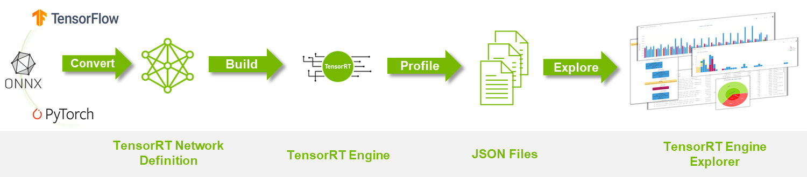

# trt-engine-explorer

`trex` is useful for initial model performance debugging, visualization of plan graphs, and for understanding the characteristics of an engine plan. **For in-depth performance analysis, [Nvidia ® Nsight Systems ™](https://developer.nvidia.com/nsight-systems) is the recommended performance analysis tool.**

> In this project, we use the `trt-engine-explorer` tool to visualize TensorRT engine files and identify layers that may affect inference accuracy based on the visualized engine.
>
> **Installation documentation**: [https://github.com/NVIDIA/TensorRT/tree/release/10.0/tools/experimental/trt-engine-explorer#installation](https://github.com/NVIDIA/TensorRT/tree/release/10.0/tools/experimental/trt-engine-explorer#installation)

## Workflow

The typical `trex` workflow is depicted below:

1. **Convert** an external model to a TensorRT `INetworkDefinition`.
2. **Build** a TensorRT engine.
3. **Profile** the engine while creating the necessary JSON files.
4. **Explore** the engine by loading the JSON files in a `trex` notebook.

[](https://github.com/NVIDIA/TensorRT/blob/release/10.0/tools/experimental/trt-engine-explorer/images/trex-overview.png)

The Python script `utils/process_engine.py` implements this workflow for ONNX models:

1. Use `trtexec` to import an ONNX model and create an engine.
2. Load the engine and create an engine-graph JSON file.
3. Use `trtexec` to profile the engine's inference execution and store the results in an engine profiling JSON file.
4. Create an engine graph diagram in SVG format.

For more information see [TensorRT Engine Inspector](https://docs.nvidia.com/deeplearning/tensorrt/developer-guide/index.html#engine-inspector) and the [Tutorial](https://github.com/NVIDIA/TensorRT/blob/release/10.0/tools/experimental/trt-engine-explorer/notebooks/tutorial.ipynb) notebook.

## Usage

In this project, the code for utilizing **trex** is located at `xtrt/tools/trex`.

- **Step 1: Build the TensorRT Engine**

Modify the code in `xtrt/tools/deploy/build/build.cu`: To set `setProfilingVerbosity` in `BuilderConfig`, you only need to uncomment the following code:

```cpp
// Config(Debug): NVTX Tracing
config->setProfilingVerbosity(nvinfer1::ProfilingVerbosity::kDETAILED);
```

After modification, continue to use the code in `xtrt/scripts/build.sh` to rebuild the TensorRT engine files.

- **Step 2: Use trtexec to Import the Engine File and Generate a JSON File**

```sh
trtexec \
    --loadEngine=./engine/yolo.plan \
    --dumpRefit \
    --dumpProfile \
    --profilingVerbosity=detailed \
    --dumpLayerInfo \
    --exportLayerInfo=./engine/layer.json \
    --exportProfile=./engine/profile.json
```

You need to modify the parameter following `--loadEngine` to the path of the actual engine file built in the first step, and `--exportLayerInfo` and `--exportProfile` to the paths where the JSON files will be saved.

- **Step 3: Run the `xtrt/tools/trex/run_trex.py` Script to Generate an SVG Image, Representing the Visualization of the TensorRT Engine.**

